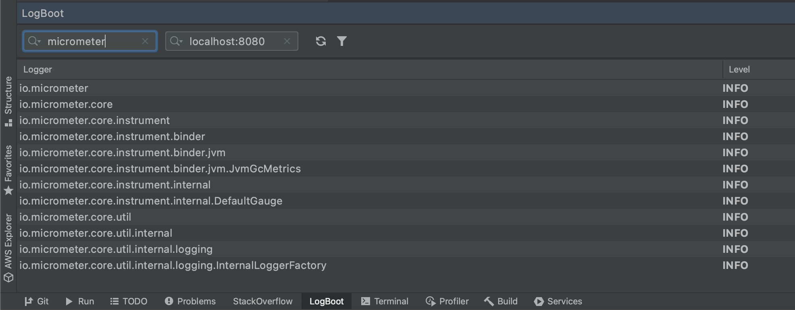
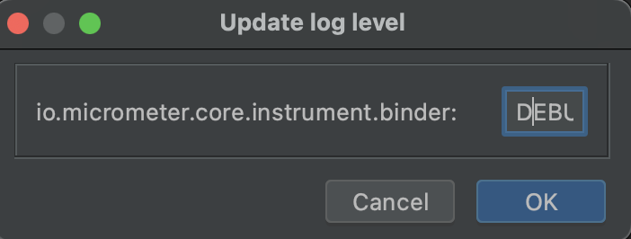

# 📃 LogBoot

This is an IntelliJ plugin to view and change loglevel on a Spring Boot application - without the need to restart or reload the log configruation.

The plugin utilizes the Spring Boot actuator log API. All you need to do is to enter the hostname and port of your Spring Boot application, and you are ready to go!

https://user-images.githubusercontent.com/16962903/125358090-c5d35f00-e368-11eb-9b04-24069c1a6fde.mov

---
## Usage
- Install the **LogBoot** plugin from the [Jetbrains marketplace](https://plugins.jetbrains.com/plugin/17101-logboot), search on **LogBoot**. 

  (Another option is to build the plugin from the source files and install it manually)

- Once installed, a new tool tab will appear named **LogBoot**

- Make sure you have a **Spring Boot** application running which exposes the actuator log endpoint, e.g `locahost:8080/actuator/loggers`

- Open the plugin and enter hostname plus port, e.g `localhost:8080` and hit return 

- If all went well, a list of loggers are now displayed

- Double click on a logger to open the update *dialogue*. Enter the desired new log level and press on the OK button

## Features
- Fetch current loggers and log level
- Search for a specific logger
- Update log level for a logger

## Build & Package
Make sure Java 17+ and Gradle is installed  
#### 🔨Build
Clone this repo to your desktop and run `./gradlew build` to build the project  
####  🕹 Run
Run IntelliJ in dev mode with `./gradlew runIde`
####  📦 Package
Package a zip file with `./gradlew assemble`  
Zip file can be found in `build/libs`
